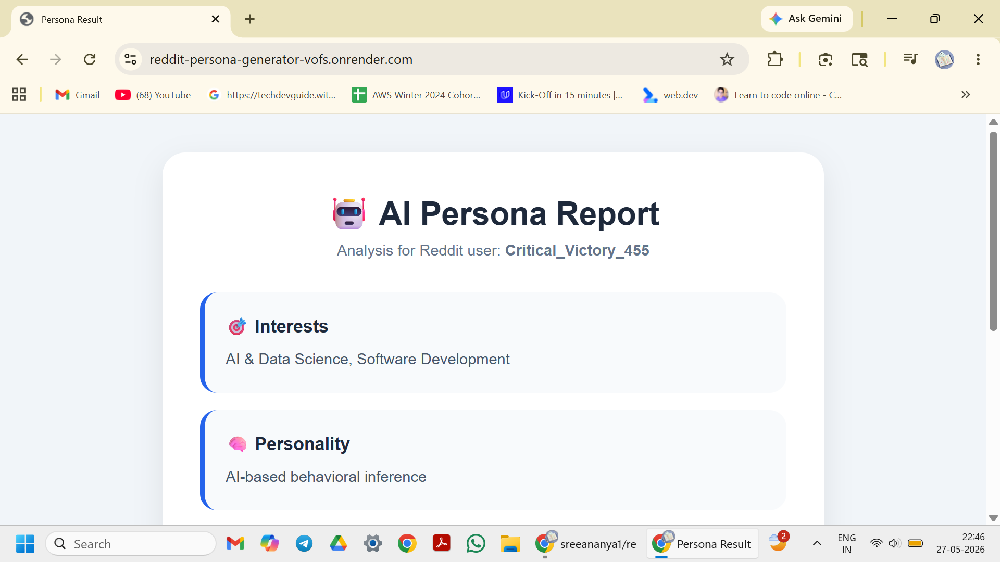
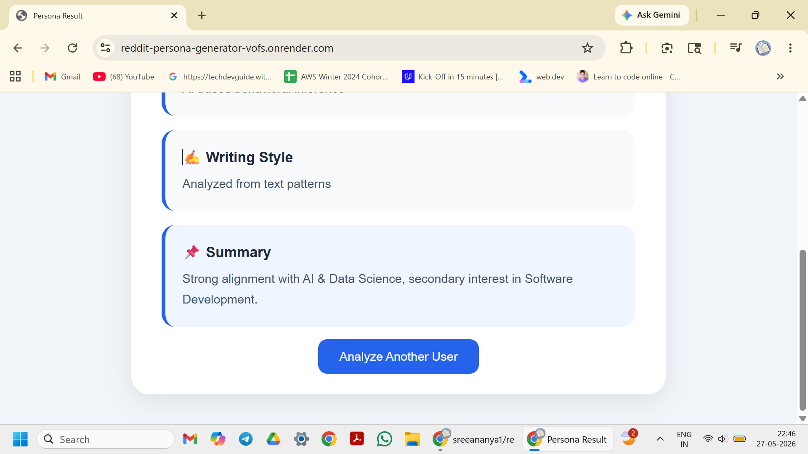

# 🤖 Reddit Persona Generator

An AI-powered web application that generates personality insights from Reddit user activity by analyzing publicly available posts and comments.

The application leverages Large Language Models (LLMs) to identify interests, behavioral traits, communication patterns, and generate concise persona summaries based on Reddit content.

## 🚀 Live Demo

https://reddit-persona-generator-vofs.onrender.com/

---

## ✨ Features

* Generate AI-powered persona reports from Reddit usernames
* Analyze user interests and behavioral patterns
* Identify communication and writing styles
* Generate concise personality summaries
* Responsive and user-friendly interface
* Flask-based backend architecture
* Deployed and accessible through Render

---

## 🛠 Tech Stack

* Python
* Flask
* HTML
* CSS
* Groq API (LLaMA 3.3 70B)
* Reddit Data Retrieval
* Render
* Git & GitHub

---

## 📸 Screenshots

### 🏠 Homepage


### 📊 Persona Analysis





---

## ⚙️ Installation

### Clone the Repository

```bash
git clone https://github.com/sreeananya1/reddit-persona_generator.git
```

### Navigate to the Project Directory

```bash
cd reddit-persona_generator
```

### Install Dependencies

```bash
pip install -r requirements.txt
```

### Configure Environment Variables

Create a `.env` file and add:

```env
GROQ_API_KEY=your_api_key_here
```

### Run the Application

```bash
python app.py
```

### Open in Browser

```text
http://127.0.0.1:5000/
```

---

## 🎯 Project Objective

The objective of this project is to explore AI-powered text analysis by transforming Reddit user activity into meaningful persona insights. It combines web development, API integration, prompt engineering, and deployment practices to create an end-to-end intelligent web application.

---

## 🔮 Future Improvements

* Enhanced persona scoring and categorization
* Improved Reddit data collection pipeline
* Support for additional social platforms
* Export persona reports as PDF
* Advanced sentiment and behavioral analysis

---

## 👩‍💻 Author

**Sree Ananya**


